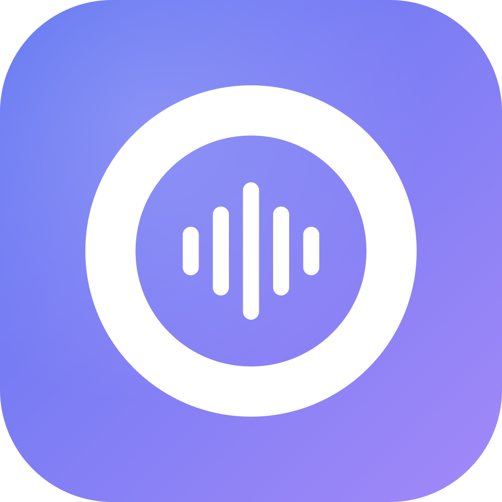

<div align="center">



# Oratio

**Push-to-Talk Diktieren für macOS**
Whisper lokal oder Cloud · optionale LLM-Nachbearbeitung · in jede App via globalem Tastenkürzel


</div>

---

## Was ist Oratio?

Oratio ist eine kleine, native macOS Menüleisten-App. Halte ein globales Tastenkürzel (Default `⌥Leertaste`), sprich einen Satz, lass los — der transkribierte Text landet an der aktuellen Cursor-Position in der aktiven App. Optional mit LLM-Nachbearbeitung (Rechtschreibung, Stil, Höflichkeit oder eigener Prompt).

Kein Dock-Icon, kein Fenster-Overhead, kein Cloud-Zwang (wenn lokal gewünscht).

## Features

- **Push-to-Talk oder Toggle** — Hotkey halten & loslassen, oder einmal drücken = Start, nochmal = Stopp
- **Zwei STT-Backends, umschaltbar in Settings:**
  - **Lokal** via [WhisperKit](https://github.com/argmaxinc/WhisperKit) mit Whisper Large v3 Turbo (Apple Neural Engine)
  - **Cloud** über jede OpenAI-kompatible API (OpenAI, Groq, OpenRouter, Azure, self-hosted …)
- **LLM-Nachbearbeitung** mit vordefinierten Modi (editierbar & zurücksetzbar):
  - Rechtschreibung & Grammatik (minimal)
  - Professioneller Stil
  - Höflich umformulieren
  - Eigener Prompt
- **Füllwort-Entferner** (regex-basiert, offline): entfernt `ähm`, `öh`, `hmm` u. a. vor der LLM-Korrektur
- **Pre-Warm + 300 ms Pre-Roll-Puffer** — keine verlorenen Wortanfänge
- **Auto-Sleep (30 s)** — Mikro-LED geht aus, wenn nicht in Gebrauch
- **Keychain-Sicherheit** — API-Keys verschlüsselt im macOS-Schlüsselbund, getrennte Einträge für Transkription & Nachbearbeitung
- **Live-Status im Menü** — Backend + aktiver Korrektur-Modus auf einen Blick

## Screenshots

Siehe die [Projekt-Website](https://adrianaltner.github.io/Oratio/) (GitHub Pages — nach Aktivierung).

## Quickstart — selbst bauen

> - Ausführliche Installation & Troubleshooting: **[INSTALL.md](INSTALL.md)**
> - GitHub-Workflow (Repo anlegen, Pages, Releases): **[GITHUB.md](GITHUB.md)**

### Voraussetzungen

- macOS 14 (Sonoma) oder neuer
- Apple Silicon (M1/M2/M3/…)
- Xcode 15+ installiert
- [xcodegen](https://github.com/yonaskolb/XcodeGen): `brew install xcodegen`

### Bauen

```bash
git clone <repo-url>
cd Oratio
xcodegen generate
open Oratio.xcodeproj
```

In Xcode `⌘R` drücken. Beim ersten Start:

1. **Mikrofon-Berechtigung** — macOS-Dialog bestätigen
2. **Bedienungshilfen** — erforderlich für `CGEvent`-basiertes ⌘V-Einfügen. System Settings → Privacy & Security → Accessibility → Oratio aktivieren → App einmal neu starten

### Erstes Diktat

1. Menüleisten-Icon klicken → warten bis „Bereit" (Modell-Download ~1,5 GB beim ersten Start)
2. In TextEdit (oder einer beliebigen App) Cursor platzieren
3. `⌥Leertaste` halten, auf Deutsch sprechen, loslassen
4. Text erscheint an der Cursor-Position

## Konfiguration

Einstellungen öffnen via Menüleisten-Icon → **Einstellungen…**

### Tab „Allgemein"

- **Tastenkürzel** ändern (Sindre Sorhus' [KeyboardShortcuts](https://github.com/sindresorhus/KeyboardShortcuts))
- **Aktivierungsmodus**: Push-to-Talk oder Toggle

### Tab „Transkription"

- **Backend**: Lokal (WhisperKit) oder Cloud-API
- **Dienst-Preset**: OpenAI, Groq, OpenRouter, Eigener
- **API-Key** (in Keychain gespeichert), Base URL, Modell
- **Verbindung testen**-Button

### Tab „Nachbearbeitung"

- **Füllwörter entfernen** (regex)
- **Modus**: Aus · Rechtschreibung & Grammatik · Professionell · Höflich umformulieren · Eigener Prompt
- **Prompt-Editor** mit „Zurücksetzen auf Standard"
- **API-Dienst** wahlweise geteilt mit Transkription oder eigener (z. B. Groq für STT + OpenRouter/Claude für Korrektur)

## Architektur (kurz)

```
Hotkey → AudioRecorder (AVAudioEngine, Pre-Roll-Ringpuffer)
      → TranscriptionService (router)
          ├── LocalWhisperBackend (WhisperKit + CoreML)
          └── OpenAIBackend (URLSession, multipart/form-data)
      → FillerCleaner (regex, optional)
      → CorrectionService (chat completions, optional)
      → TextInserter (Clipboard + CGEvent ⌘V + Restore)
```

Details siehe [docs/index.html](docs/index.html) oder den [Implementation-Plan](https://github.com/).

## Tech Stack

| Komponente | Zweck |
|---|---|
| SwiftUI + `MenuBarExtra` | UI |
| `NSApplicationDelegateAdaptor` | App-Start-Koordination |
| `@Observable` | State-Management |
| `AVAudioEngine` | Mic-Input + Pre-Warm |
| WhisperKit | Lokale Transkription |
| KeyboardShortcuts | Globale Hotkeys |
| Security (Keychain) | API-Key-Storage |
| URLSession | OpenAI-kompatible HTTP-APIs |
| XcodeGen | `project.yml` → Xcode-Projekt |

## Dateistruktur

```
Oratio/
├── project.yml               # xcodegen-Manifest (Quelle der Wahrheit)
├── Sources/
│   ├── OratioApp.swift       # @main + AppDelegate als Coordinator
│   ├── AppState.swift        # @Observable State
│   ├── MenuBarController.swift
│   ├── SettingsView.swift    # 3 Tabs: Allgemein / Transkription / Nachbearbeitung
│   ├── HotkeyManager.swift   # PTT + Toggle
│   ├── AudioRecorder.swift   # Pre-Warm + Ringpuffer + Hochpass + Fade-In
│   ├── TranscriptionService.swift
│   ├── LocalWhisperBackend.swift
│   ├── OpenAIBackend.swift
│   ├── CorrectionService.swift
│   ├── FillerCleaner.swift
│   ├── APIPreset.swift
│   ├── KeychainStore.swift
│   ├── TextInserter.swift
│   └── Assets.xcassets/
├── Resources/
│   └── AppIcon.icns          # generiertes App-Icon
├── scripts/
│   └── gen_icon.swift        # Icon-Generator (CoreGraphics)
├── docs/                     # GitHub-Pages-Website
└── README.md
```

## Entwicklungs-Hinweise

- **Sandbox ist AUS** — notwendig, damit `CGEvent.post` Tasten in andere Apps injizieren kann. Deshalb kein Mac-App-Store-Vertrieb möglich (für Eigennutzung irrelevant).
- **Signierung**: ad-hoc (`CODE_SIGN_IDENTITY: "-"`) — nach jedem Rebuild kann macOS die Accessibility-Berechtigung verlieren. Reset:
  ```bash
  pkill -f Oratio; tccutil reset Accessibility org.altner.Oratio; open Oratio.xcodeproj/...
  ```
  Stabile Lösung: Mac Developer Cert in Xcode erstellen und in `project.yml` als `DEVELOPMENT_TEAM` setzen.
- **Modell-Cache**: `~/Documents/huggingface/models/argmaxinc/whisperkit-coreml/…`
- **Audio-Format**: 16 kHz Mono Float32 (Whisper-Standard)
- **Projekt regenerieren** nach `project.yml`-Änderungen: `xcodegen generate`

## Bekannte Einschränkungen

- Nur Apple Silicon (kein Intel-Support)
- Kein Mac-App-Store wegen deaktivierter Sandbox
- Ad-hoc-Signierung → TCC-Zurücksetzen nach Rebuilds nötig
- Anthropic API nicht direkt (via OpenRouter nutzbar)
- Whisper läuft bei kurzen Clips (<0,5 s) unzuverlässig — wird abgefangen

## Roadmap (kein Versprechen)

- Deutsch-fine-getuntes Modell (`primeline/whisper-large-v3-turbo-german`) via whisperkittools
- Verlauf der letzten N Transkriptionen
- Auto-Launch beim Login
- Signed + notarized DMG-Build-Setup
- Anthropic Messages API als nativer Adapter

## Credits

- [WhisperKit](https://github.com/argmaxinc/WhisperKit) von argmaxinc
- [KeyboardShortcuts](https://github.com/sindresorhus/KeyboardShortcuts) von Sindre Sorhus
- OpenAI Whisper (Modell-Architektur)

## Lizenz

MIT (oder was du vergibst). Eigenbau-Projekt, nutze es wie du magst.

---

Gebaut mit Claude Code · Swift · Apple Silicon · 🎤
